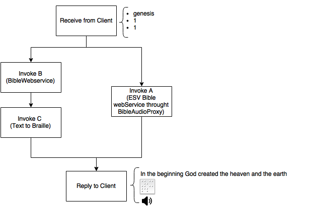
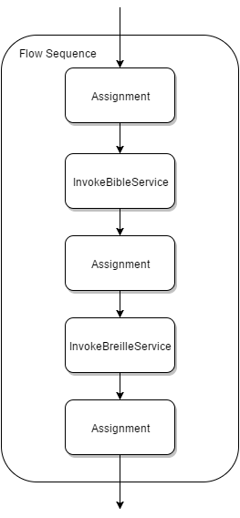
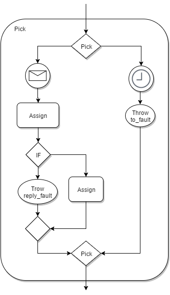
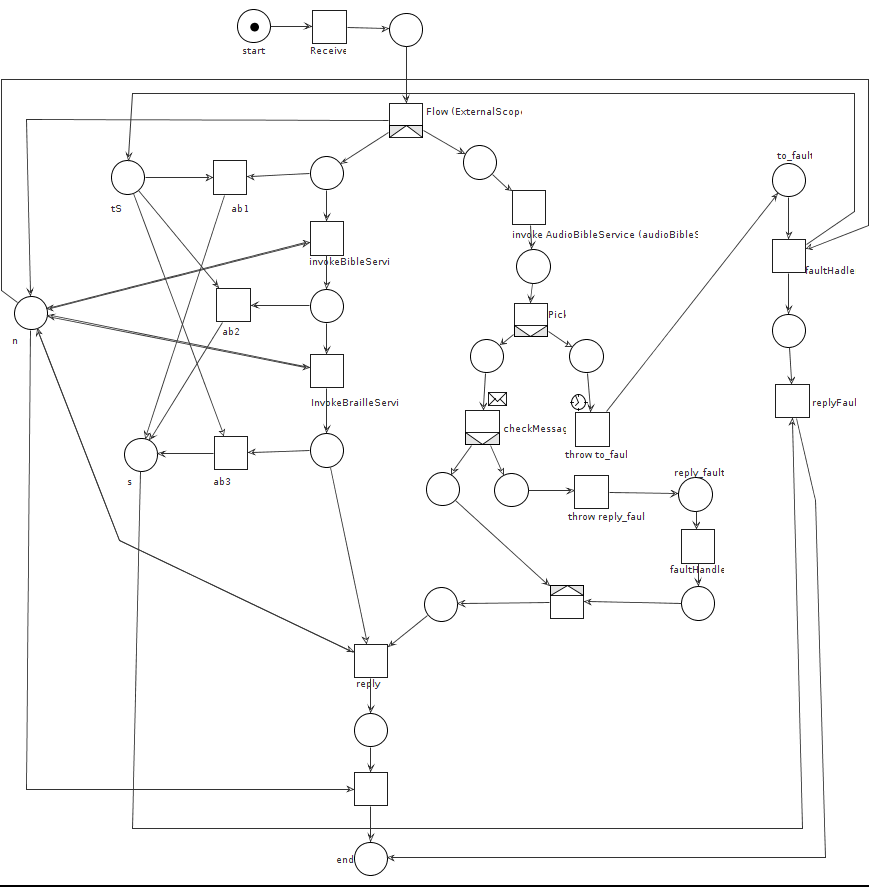

% SSE Project: BibleBraille Service
% Luca Rinaldi
% 12 January 2016

# Introduction
BibleBraille is a service with the goal	of providing both Braille and	an	audio version	of a specified Bible verse.



More	in	detail,	this	service	provides the	`getVerse`	SOAP	operation	that, as	written in the `BibleBrailleWSDL.wsdl`	file, takes as input the following parameters:

- the	name	of	the	bible	book	(e.g.	genesis).
- the	number	of	the chapter	(e.g.	1).
- the	specific	verse	(e.g.	1).

As result, the service sends	back	to the client the following response:

- the	base64	binary	representation	of	an image, which represents the braille conversion of the bible verse.
- the	URL link	to	an mp3	file containing the recording of	the	verse.
- the	original	text	version of	the	verse.

This service uses the  following three external services to compose the response:

- [**ESV Bible webService**](http://www.esvapi.org/) (later on A) a complete bible web service, that provides text and audio tracks of the *Contemporary English Bible*. The orchestrator exploit it only to get the link to the audio tracks, by means of this REST resource: `http://www.esvapi.org/v2/rest/passageQuery.php/`.
- [**BibleWebservice**](http://www.webservicex.net/New/Home/ServiceDetail/6) (later on B) a REST and SOAP bible service that retrieves a specific verse of the *King James Version* of the Bible; for so the orchestrator invokes the `GetBibleWordsByChapterAndVerse` SOAP operation, described in the WSDL (http://www.webservicex.net/BibleWebservice.asmx?WSDL) of B.
- [**Text to Braille**](http://www.webservicex.net/New/Home/ServiceDetail/58) (later on C) a REST and SOAP service that converts a plain text in braille, returning a base64Binary string representing of an image. The orchestrator uses the `BrailleText` SOAP operation described in the WSDL (http://www.webservicex.net/braille.asmx?WSDL) of C.


# WS-BPEL	implementation
The WS-BPEL of the service orchestrator is composed of two parts, the **BibleBrailleComp** service, the real orchestration of the external services and the **BibleAudioProxyComp** a service proxy that asynchronously calls the service A, which does not provide itself an asynchronous interface.

The proxy only sends back all the responses from A to the caller, keeping all the logic needed to elaborate the received messages at the orchestrator. Care was taken in developing the callback mechanism of the proxy in such a way that its responses also contained the original input, thus enabling the orchestrator to create a correlation between the asynchronous invocation and the callback result.


## WS-BPEL	processes
To compute its answer message the orchestrator executes concurrently to tasks. On one hand, service B is called to retrieve the bible verse, afterwards a call of service C obtains the braille conversion of that verse. On the other hand, the parallel invocation of service A asynchronously call of the service A gets the audio of the verse.



At this point, we can have different outcomes:
- if the callback message is not received within a time window of 10 seconds, the service throws a `to_fault` error, the process is aborted and the fault is forwarded to the client;
- if the callback message comes before the timeout, the message is parsed, the file id of the audio verse is retrieved and finally the URL of the audio track is composed.

If any error shows up during the parsing of the response, then a `reply_fault` is thrown without interrupting the flow of the process but simply replying an error code instead of the URL, i.e. the client will only receive the verse and its braille encoding.



This behaviour is implemented  employing two scopes and two different fault handler respectively. Particularly there are the `ExternalScope` scope that covers the whole service and the `BibleAudioScope` scope that covers the flow sequence with the invocation to A.
So when the `to_fault` fault is thrown, the fault handler in the `ExternalScope` catches it and the execution of the process is interrupted; otherwise when the `reply_fault` is thrown, the fault handler in the `BibleAudioScope` catches it.

## Test
To test the BibleBraille Service four types of test were designed. The former two contain the correct results of standard invocations, the latter two possible faulty calls.

Below the tests *correct1* and *correct2* are listed:
```
<bib:getVerse>
  <book>genesis</book>
  <chapter>1</chapter>
  <verse>1</verse>
</bib:getVerse>
```
```
<bib:getVerse>
  <book>Luke</book>
  <chapter>9</chapter>
  <verse>1</verse>
</bib:getVerse>
```
Unfortunately, the selected services dispose of different translations of the Bible, for minor differences between the reported verse and its reading exist.

Among all the possible wrong input the following one is used to trigger the `reply_fault` error:
```
<bib:getVerse>
  <book>test</book>
  <chapter>23</chapter>
  <verse>22</verse>
</bib:getVerse>
```

In this case, the received response is composed of an empty text tag, a blank image and an appropriate error message in the audio tag, hence it looks like:
```
<m:getVerseResponse>
  <braille>9j/4AAQSkZJRgABAQEAYABgAAD/2wBDAAgGBgcGBQgHBwc....</braille>
  <audio>reply_fault: no audio avaible</audio>
  <text></text>
</m:getVerseResponse>
```

The most tricky test is the one for the `to_fault`, having to introduce a delay in the asynchronous answer of the proxy in such a way that the timeout of 10 seconds is exceeded. For this reason by adding a wait command in the WS-BPEL of the proxy before the invocation we get the following output:
```
<SOAP-ENV:Fault>
  <faultcode>SOAP-ENV:Client</faultcode>
  <faultstring>to_fault</faultstring>
  <detail>
    <error>to_fault: request timeout</error>
  </detail>
</SOAP-ENV:Fault>
```


# Analysis	of the	WS-BPEL	specification
The control flow of the main WS-BPEL process is also implemented through a workflow net, and thanks to the WoPeD software it is also proved sound. Actually this does not guarantee that the orchestrator always works as expected, nevertheless it is indeed a good result, from a modeling point of view.



The more difficult part in the implementation of the workflow net is the error handling of the two kinds of fault. Whereas the `reply_fault` is handled easily -- adding a XOR-join transition at the end of the flow in such a way the answer is build correctly either or with out the error message -- because it does not disrupt the flow of the process.

On the other hand the `to_fault` must interrupt the execution of the other parallel flow no matter in which place the related token is, i.e. either if no invocation are done yet, if only the invocation to service B or both invocation are done.

To achieve this goal three new places are added:

- `n`, filled when no error occurs,
- `tS`, filled when the stop procedure starts,
- `s`, filled when the scope stops its execution,

and also three new transitions (`ab1`, `ab2`, `ab3`) connected to the place related to the original scope activity.
So when a token is placed in `tS` the scope stops the normal execution and the token present in the scope is absorbed.
Eventually the place `s` is filled and then the fault handler can complete its execution, and an error message is sent back to the client.
